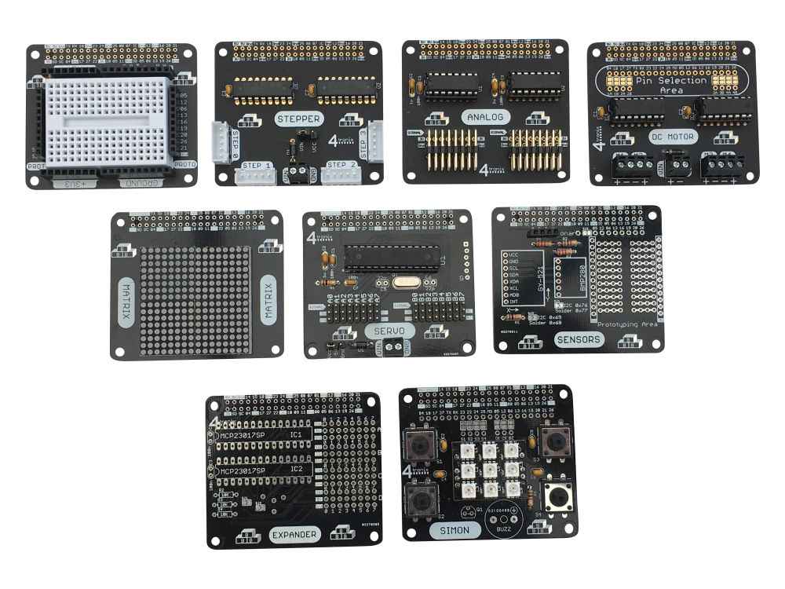

# K9 Main Body

This folder contains the K9 main-body hardware and project-reference material.
It is part of [robot-NautiPi](../README.md), not an active software repository.

  

## Contents

- `BackButtons/` — KiCad design files and supporting material for the rear-button hardware.
- `BCM/` — KiCad design files and embedded material for the K9 body-control module.
- `MotorDriver/` — KiCad design files for the motor-driver hardware.
- `k9/` — K9 project photographs, media, and related reference material.
- `to sort/` — retained K9 design, firmware, mechanical, photographic, and reference material requiring review and classification.
- `OverView.drawio` and `OverView.png` — K9 system overview material.

## Current status

The design and reference material are retained for continued review and
development. Board revisions, assembly, electrical commissioning, actuator
safety testing, and integration with K9 are not recorded as complete here.

Material under `to sort/` is not an approved source of truth. Before using it,
confirm the relevant board revision, firmware revision, wiring, component
values, and physical test evidence.

## Active software sources

The active robot software is maintained in
[robot-CuttleOS](https://github.com/PhilipMcGaw/robot-CuttleOS). Hardware
interfaces, robot profiles, deployment, and validation status are defined by
that project and its current documentation.

## Licensing

See the parent [NautiPi licensing map](../LICENSES.md). Hardware design files
are covered by CERN-OHL-S 2.0; project software, documentation, and reference
material are covered by CC BY-NC-SA 4.0, subject to any separate third-party
notices.

## People who have helped

- Philip 'Skippy' McGaw - <philip@mcgaw.eu> - [philipmcgaw.com](https://philipmcgaw.com)
- Tamarisk 'NotQuiteHere' McGaw - <tamarisk@mcgaw.eu> - [tamarisk.it](https://tamarisk.it)
- Bob 'thinkl33t' Clough - <bob@clough.me> - [thinkl33t.co.uk](https://thinkl33t.co.uk)