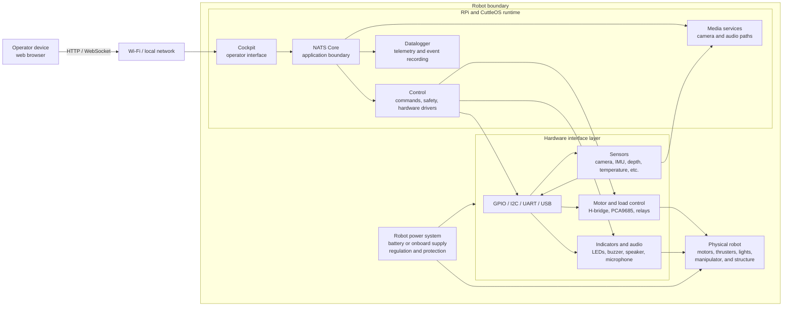

# ROV Main Body

This folder contains the ROV main-body hardware archive: PCB designs, component
records, mechanical references, historical project material, and integration
notes. It is part of [robot-NautiPi](../README.md), not an active software
repository.

## Contents

- `CPS/` — component and bill-of-materials spreadsheets.
- `KiCAD/` — board designs, schematics, footprints, datasheets, and related design resources.
- `HighROV-Cutting-Patterns/` — retained mechanical cutting patterns and reference documents.
- `ROV/` — historical ROV photographs, reports, presentations, and reference files.
- `docs/pins.md` — historical pin and serial reference notes that require verification.
- `docs/` — integration guidance and historical engineering notes.
- `tests/` — documentation checks for the retained integration material.

## Current status

The hardware designs and reference material are retained for review and future
work. Individual board revisions, assembly, electrical commissioning, sensor
calibration, and integration with the ROV require separate evidence. Nothing in
this archive, including `docs/pins.md`, authorises a physical wiring or Control
allocation by itself.

## Interface layers

The following diagram adapts the useful structure from the former ROV overview presentation
into a reusable logical view of the robot interface layers. It replaces the
ROV-specific umbilical and topside power-management blocks with the Wi-Fi and
robot-side power boundaries used by the current architecture.

This is a logical interface view, not an electrical wiring schematic. See
[`docs/interface-layers.md`](docs/interface-layers.md) for the layer
responsibilities and the source-of-truth split between CuttleOS, NautiPi, and
SquidLink. Use the KiCad schematics and hardware wiring records for connector,
pin, power, and safety details.
## Active software sources

The active robot software is maintained in [robot-CuttleOS](https://github.com/PhilipMcGaw/robot-CuttleOS).
The independent simulation and integration-test environment is maintained in
[robot-SquidLink](https://github.com/PhilipMcGaw/robot-SquidLink). Their
interfaces and status documentation take precedence over the historical
software-orientation notes retained under `docs/`.

## Documentation

Start with [`docs/README.md`](docs/README.md) for the retained integration
notes. The module and board READMEs inside `KiCAD/` provide more specific
information where available. Historical research, imported reference files,
and third-party material must retain their own notices.

## Licensing

See the parent [NautiPi licensing map](../LICENSES.md). Hardware design files
are covered by CERN-OHL-S 2.0; project software, documentation, and reference
material are covered by CC BY-NC-SA 4.0, subject to any separate third-party
notices. The parent NautiPi licensing map is the source of truth for this folder.

## People who have helped

- Philip 'Skippy' McGaw - <philip@mcgaw.eu> - [philipmcgaw.com](https://philipmcgaw.com)
- Tamarisk 'NotQuiteHere' McGaw - <tamarisk@mcgaw.eu> - [tamarisk.it](https://tamarisk.it)
- Bob 'thinkl33t' Clough - <bob@clough.me> - [thinkl33t.co.uk](https://thinkl33t.co.uk)