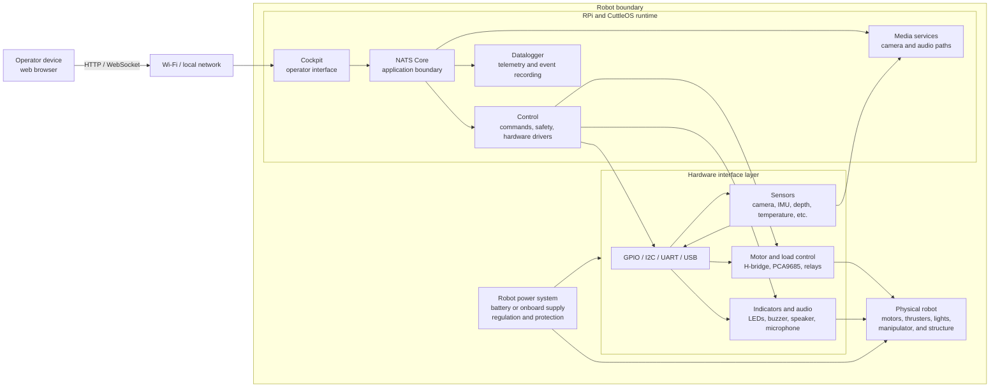

# Robot interface layers

This diagram converts the useful structure from the former ROV overview presentation
into a Markdown-friendly view. It describes the logical interface layers shared
by the ROV, K9, and Testbot. Robot-specific hardware is shown as examples and
must be replaced with the active robot profile and hardware record.

The diagram is intentionally a logical architecture view. It does not replace
the KiCad schematic, wiring record, connector pinout, power budget, or safety
case for a particular robot.

## Layer responsibilities

- The operator device presents the human interface. It does not connect
  directly to NATS or physical hardware.
- Wi-Fi or another network carries the application traffic to the robot. The
  transport can vary by robot without changing the application contract.
- The RPi runs the CuttleOS services. Cockpit handles operator interaction,
  Control owns command validation and safety, Datalogger records agreed data,
  and media services handle camera and audio paths.
- NATS Core carries the application-facing commands and telemetry between the
  CuttleOS services.
- The hardware interface layer maps the robot profile to the physical buses,
  control boards, sensors, indicators, and audio devices.
- The power system is part of the robot hardware boundary. Its regulators,
  protection, distribution, and return paths belong in the hardware records.

For a particular robot, the authoritative implementation is split across the
three repositories: CuttleOS defines the application contract and profile,
NautiPi records the physical implementation, and SquidLink represents the
logical behaviour in ROS 2/Gazebo.